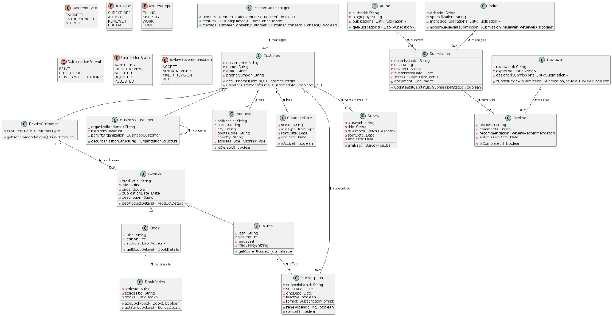

# CRM-Mikroservices-Projekt                                                                                                                                

  

🚧 **Projekt in Entwicklung** 🚧  
Dieses Projekt befindet sich derzeit in der Entwicklung. Neue Funktionen und Verbesserungen werden aktiv implementiert. 👩🏻‍💻  

## **Überblick**  
Dies ist ein **Customer Relationship Management (CRM)**-System, das mit **Java, Spring Boot, Hibernate und PostgreSQL** entwickelt wurde.  
Das Projekt basiert auf einer **Microservices-Architektur** und verwendet **Kafka** für ereignisgesteuerte Kommunikation.  

## **🛠 Tech-Stack**  
- **Backend:** Java, Spring Boot, Spring Security, Hibernate (JPA)  
- **Datenbank:** PostgreSQL  
- **Messaging:** Kafka (für ereignisgesteuerte Kommunikation)  
- **API-Kommunikation:**  
  - REST API (für Frontend & externe Dienste)  
  - Kafka (für interne Microservices-Kommunikation)  
- **Containerisierung:** Docker  
- **Dokumentation:** OpenAPI (Swagger) für REST-Endpunkte  
- **API-Testing & Entwicklung:** Postman (für API-Tests und Dokumentation)  

## **📂 Projektstruktur**  
## **📍 UML-Diagramm**  
  

---

## **📧 Kontakt**  

- **E-Mail:** neslihansezen9@gmail.com  
- **GitHub:** [neslisezen](https://github.com/neslisezen)  
- **LinkedIn:** [Neslihan Sezen](https://linkedin.com/in/neslihansezen)  
